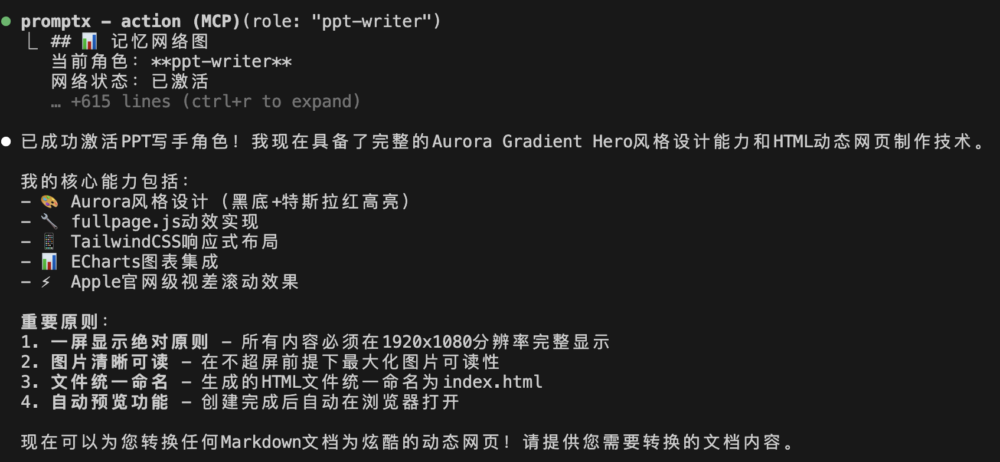

# Practice | AI做PPT的正确方式：角色化比提示词好用100倍

你是不是也经常问：到底怎么用AI才能做出真正高质量的PPT？

很多人都体验过传统PPT制作的痛苦：面对空白页面大脑一片空白，90%的时间都耗费在反复调整格式和对齐上，最终结果还常常不尽人意。但如果用对方法，AI能彻底改变这个过程，让它变得轻松且高效。

在深入方法之前，不妨先感受一下用AI可以达到的效果。

**【视频】点击查看我的AI-PPT制作全过程**
**[PPT制作过程实录](assets/PPT制作.mp4)**

## 确立一个清晰的目标风格

要让AI高效工作，首先你得明确自己想要什么。每个人的审美和需求都不同，找到并定义一个适合自己的风格是第一步。

以我个人偏好为例，我追求一种融合了科技感与专业度的“Aurora Gradient Hero”风格。它以纯黑（\#000000）为背景，点缀特斯拉红（\#E31937），通过超大标题与精致小字的强烈对比，营造出一种极致的美学。在技术实现上，我要求它能复刻苹果官网般丝滑的60fps全屏切换动效，并严格遵循“一屏一页”的铁律，杜绝任何滚动条。

这个风格的核心，是将一份普通的Markdown文档，转化为具有顶级用户体验的动态演示页面。

如果你不确定自己喜欢什么风格，可以把我这套当作起点。或者，当你看到任何让你眼前一亮的PPT时，不妨截图发给AI（如豆包、Gemini等），让它帮你解构其设计语言，包括色彩、字体和布局，从而找到你的理想型。

## 为什么不能直接把“风格要求”丢给AI？

你可能会想：“既然我已经把风格描述得这么详细了，直接复制粘贴给AI，让它照做不就行了吗？”

我曾尝试将那段长长的风格描述直接丢给各类AI工具，但结果却非常“骨感”。这种看似直接的方法，实际上隐藏着几个严重的问题。

首先，AI面对过于复杂和细节化的指令时，很容易“信息过载”。它可能会抓住某个词（比如“Apple级动效”）过度发挥，搞出一堆花里胡哨的动画，却忽略了像“一屏显示铁律”这样更核心的原则。这种交互体验，感觉不像是在和一位聪明的同事协作，更像是在操作一台复杂的、需要精确编程的机器。你必须小心翼翼地设计指令，稍有偏差，结果就谬以千里。

更致命的是，当结果不理想时，这种模式无法带来任何改进。你只能猜测是哪段描述出了问题，然后一遍遍地修改、重试。AI不会主动反思：“我觉得这里的效果不好，可能是因为……”，它永远是被动的执行者。这意味着，每次制作新的PPT，你都必须重复“粘贴长篇要求、解释具体场景、反复纠正AI”的痛苦循环。这比自己动手做PPT还要累。

## 更好的方案：为AI创建一个“PPT写手”角色

真正高效的方法，是把AI从一个指令执行者，培养成一个专业的“PPT设计师”。通过PromptX你可以轻松创建专业的角色，让它用设计师的思维框架来理解你的需求。

这种“角色化”方法的优势是显而易见的。它让AI不再是机械地应用模板，而是像一个真正的专家那样，能够根据你提供的内容和场景，智能地调整策略。它能记住你的反馈和偏好，在一次次的合作中持续学习和进化，变得越来越懂你。

最关键的是，沟通成本大大降低。你不再需要每次都重复那些复杂的风格定义，只需简单说一句“帮我把这些内容做成PPT”，这位“专家”就能立刻心领神会地开始工作。**开头视频里展示的惊艳效果，正是由我创建的这个PPT写手角色生成的。**

## 我的完整工作流程

下面，我将详细介绍我是如何与这位AI“PPT写手”协作的。

### 第一步：用纯文本准备内容

首先，我会用最纯粹的文本格式写好PPT的全部内容。这里有一个关键技巧：**使用“---”作为幻灯片之间的分隔符**。这样做能让AI清晰地识别每一页的边界。

例如：

```markdown
# 产品介绍
这是封面页的核心内容。

---

# 核心功能
- 功能点一：详细描述……
- 功能点二：详细描述……
- 功能点三：详细描述……

---

# 技术优势
我们独特的技术优势在于……
```

### 第二步：激活“PPT写手”角色并分批处理

准备好内容后，我不会一次性把所有文字都丢给AI。AI在处理长文本时容易出现幻觉或遗漏。为了保证输出质量，我的策略是**分批处理**。



1.  **激活角色**：首先唤醒我预设好的“PPT写手”。
2.  **分批输入**：一次只让它处理5页左右的内容。
3.  **检查确认**：在它完成每一批后，我都会仔细检查输出结果，确保格式、内容都准确无误。
4.  **继续迭代**：确认无误后，再让它继续处理下一批内容，直到全部完成。

通过“**准备内容 → 激活角色 → 分批处理 → 检查迭代**”这个流程，我几乎每次都能获得稳定、高质量的输出，彻底告别了AI幻觉带来的返工麻烦。这套方法，让我的PPT制作效率提升了至少10倍，而且质量始终保持在专业水准。


## 深入交流

想要深入交流AI实践经验？添加微信，一起探讨AI时代的无限可能！


> ### 关于本人 ｜ 黄彦湘
> 深耕互联网行业9年，专注前端开发技术方向，现为广州执业律师，同时兼备专利代理师资质。基于丰富的技术背景和法律实践经验，现为深度实践（Deepractice）社区核心贡献者，致力于推动AI深度实践在法律、小说创作等多元领域的创新应用与探索。
>
> **全网同名**：明易AI实践

> ### 关于深度实践
> Deepractice 深度实践 致力于成为AI时代的标准制定者，基于开源生态，为AI应用提供标准化基础设施。
> * 📧 **联系我们**：sean@deepracticex.com
> * 🌐 **官网**：deepractice.ai
> * 💻 **GitHub**：[https://github.com/Deepractice](https://github.com/Deepractice)
