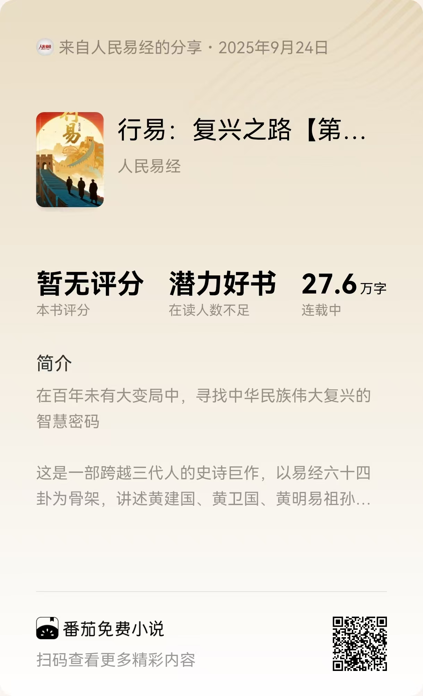

## 直接看效果

最近很多朋友问我：平时是怎么写小说的？

废话不多说，直接展示我平时写小说的流程：

**[第34篇文章创作过程视频](./assets/第34篇文章.mp4)**

这样写出的文章质量如何呢？来，听听看！

**[创作出来的文章音频效果](./assets/第34篇文章.mp3)**

读完是不是很震撼？

## SAGA方法论的诞生

其实我写小说也不是一帆风顺的。

一开始遇到各种质疑："AI写的AI味太重"、"长篇一致性问题AI解决不了"、"你没写过小说，能写好吗？"...

后来在B站做了几次直播分享，改变了一些人的看法。但更重要的是，在这个过程中我研究出了一套SAGA方法论。

今天就来详细分享这套方法。

---

## SAGA核心：专业团队协作

什么是SAGA方法论？他其实是由4个单词组成，分别是：

**SAGA = Setting → Architecture → Generation → Assessment**
（设定 → 架构 → 生成 → 评估）

### 传统AI创作的根本问题

在深入讲解SAGA方法论之前，我们先分析一下传统小说写作跟普通AI写作的痛点。

**传统手工写小说5大痛点**：
1. **【构】构思混乱** - 世界观设定自相矛盾
2. **【慢】速度慢** - 一天2000字已经很累
3. **【卡】经常卡文** - 不知道情节怎么发展
4. **【错】前后矛盾** - 几十万字很难保持一致
5. **【累】容易放弃** - 长篇创作周期太长

**普通AI创作5大痛点**：
1. **【写】提示词工程** - 要学会写复杂提示词
2. **【乱】角色混乱** - 没有专业分工，一个AI包打天下
3. **【忘】上下文丢失** - AI记不住前面的设定
4. **【飘】质量不稳** - 有时好有时差，难以控制
5. **【死】扩展困难** - 新想法融入要大改重构

无论是传统手工创作还是普通AI协作，都面临同一个核心问题：**缺乏专业化分工**。

传统手工创作是一个人承担所有角色：既要当架构师设计世界观，又要当编剧规划情节，还要当写手创作内容。

普通AI创作是一个AI承担所有任务：既要设定又要规划，既要创作又要检查，什么都做但什么都做不专业。

就像建房子只有一个工人，既要画设计图，又要搭框架，还要装修施工。结果必然是质量不稳定、效率低下。

### SAGA的解决方案：4个专业AI角色分工协作

- **架构师**：负责世界观设定，确保逻辑自洽
- **规划师**：负责故事结构，保证情节连贯
- **写手**：负责内容创作，专注文学表达
- **总监**：负责质量监控，确保协作流程

这实现了从"命令AI"到"与AI团队协作"的根本转变。

## 《行易》实战验证

### 为什么选择《行易》验证SAGA方法论？

这是一个"疯狂"的项目：

- **64卦386爻精确对应建国百年史**：每一卦都对应特定历史时期，需要精密的结构设计
- **三代人展现民族复兴史诗**：三代人物展现百年变迁
- **易经智慧融入历史叙事**：将《易经》从算命书还原为世界观，文化传承与故事叙述并重
- **华杉式文学风格传承**：历史厚重感与现代表达技法的完美结合

这种创作复杂度，正好验证SAGA能否解决：

✅ **长篇一致性问题**：64卦结构，前后呼应不能有丝毫偏差
✅ **文化融合问题**：易经智慧要自然融入，不能生硬嫁接
✅ **结构复杂性问题**：三代人三个时期的时空交织
✅ **风格统一性问题**：华杉式历史文学的深厚底蕴

### 传统方式为什么搞不定？

我最初尝试用传统AI方法，确实一周完成了88.6万字初稿。但问题严重：

- 前后设定矛盾，主角经常被写"死"
- 64卦结构偏离，完全不按规划走
- 文化融合生硬，易经智慧变成了标语口号
- 风格忽高忽低，像不同人写的

这些系统性问题让我意识到：必须要有系统性的解决方案。

## SAGA三层质量保障

### SAGA的质量保障体系

**设定层约束**：所有内容必须符合"小说宪法"
- 《行易》的历史背景、人物关系、64卦结构都写入设定文件
- 任何创作都必须严格遵循，违反即拒绝输出

**流程层监控**：每个环节都有质量检查点
- 架构师输出设定 → 总监检查逻辑一致性
- 规划师设计情节 → 总监检查是否符合设定
- 写手创作内容 → 总监检查质量和风格

**智能路由机制**：自动识别需求，分配给最合适的角色
- "调整李浩的性格特点" → 自动路由给架构师
- "规划第五卦的冲突情节" → 自动路由给规划师
- "写一段校园环境描述" → 自动路由给写手

### 实际效果如何？

现在《行易》的创作状况：

- **前后矛盾？不存在的**：设定层强制约束，逻辑完全自洽
- **风格不统一？写手专门负责**：华杉式风格稳定传承
- **情节不合理？规划师专业把关**：64卦结构精密对应
- **偏离主题？总监实时监控**：易经智慧自然融入

这就是开头视频展示的真实效果背后的原理。

如果对我《行易》感兴趣，欢迎阅读：

## 技术背后的初心

在分享完技术后，我想说明我的初心：

我写小说，不是为了快速变现，而是出于情怀和兴趣。我希望能写出真正优质的长篇小说。

正如我常说的一句话：
**"百年之后我们都已离去，但我们的思想依然能在这世间熠熠生辉"**

基于这个理念，我开始了《行易》的创作，也开发出了这套SAGA方法论。

SAGA不只是写小说的工具，更是AI协作的新范式。它让我们从"使用AI"升级为"与AI团队协作"，这是人机关系的根本性突破。

## 通用AI协作范式

### SAGA方法论的更大意义

任何复杂的AI协作场景，都可以用"专业团队思维"来设计：

**软件开发领域**：
- 架构师：系统设计和技术选型
- 程序员：代码实现和功能开发
- 测试员：质量检查和bug修复
- 产品经理：需求管理和项目协调

**内容创作领域**：
- 策划师：内容定位和整体规划
- 设计师：视觉设计和用户体验
- 文案师：文字创作和表达优化
- 编辑：质量把控和风格统一

**商业分析领域**：
- 数据分析师：数据处理和模型构建
- 业务专家：行业洞察和需求理解
- 战略顾问：方向制定和决策支持
- 项目经理：进度管控和资源协调

### 范式突破的核心价值

这是AI协作从"工具使用"到"团队协作"的范式突破：

- **从单点到系统**：不再依赖单一AI的全能表现
- **从随机到标准**：建立可复制、可预期的质量标准
- **从命令到协作**：从"你帮我做"变成"我们一起做"

这种转变的意义，不仅仅在于提升效率，更在于重新定义了人与AI的协作关系。

## 深入交流

如果你对SAGA方法论感兴趣，想深入交流技术细节和实践经验：

**欢迎加我微信深入交流**

让我们一起探索AI协作的无限可能，创造真正有价值、有温度的作品。

---

> ### 关于本人（黄彦湘）
> 深耕互联网行业9年，专注前端开发技术方向，现为广州执业律师，同时兼备专利代理师资质。基于丰富的技术背景和法律实践经验，现为深度实践（Deepractice）社区核心贡献者，致力于推动AI深度实践在法律、小说创作等多元领域的创新应用与探索。
>
> **全网同名**：明易AI实践

> ### 关于深度实践
> Deepractice 深度实践 致力于成为AI时代的标准制定者，基于开源生态，为AI应用提供标准化基础设施。
> * 📧 **联系我们**：sean@deepracticex.com
> * 🌐 **官网**：deepractice.ai
> * 💻 **GitHub**：[https://github.com/Deepractice](https://github.com/Deepractice)
