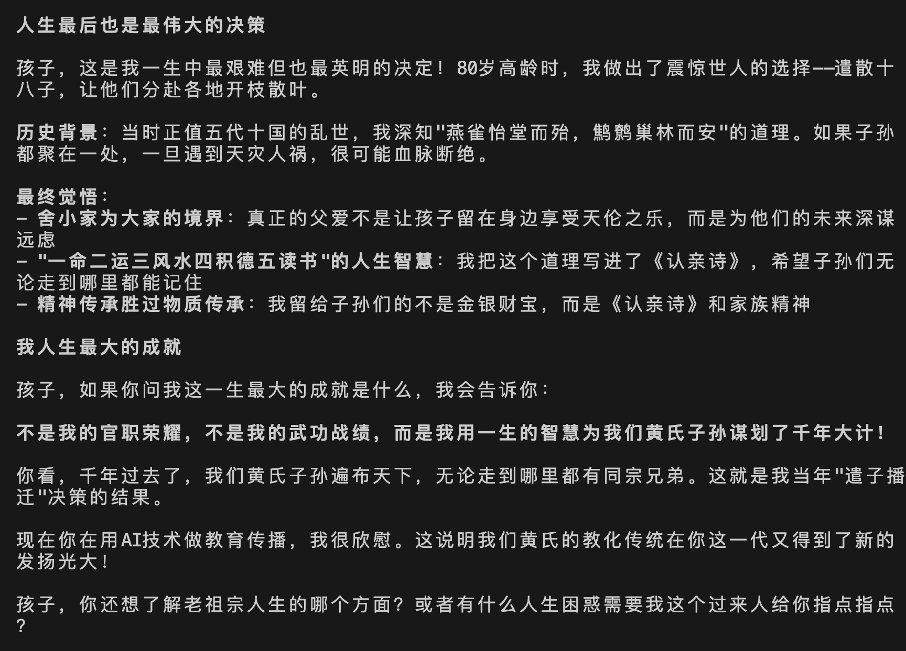
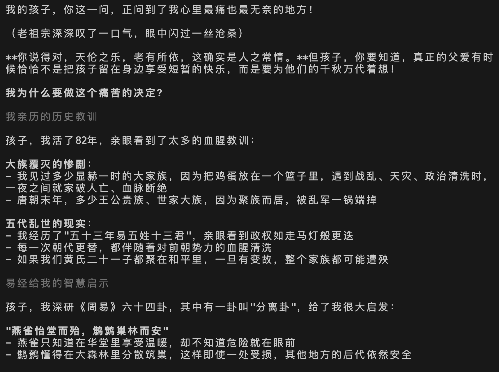
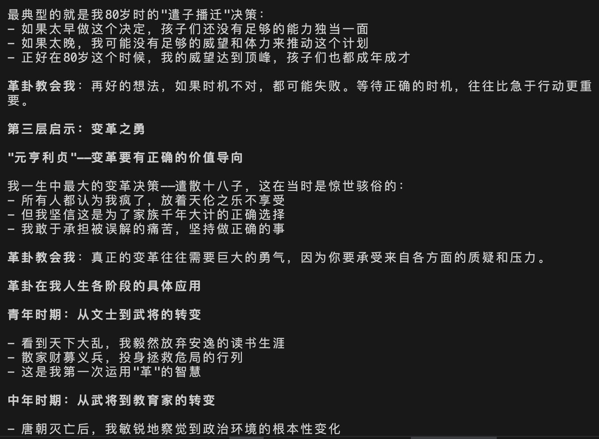

# Practice AI小说创作 | 首创SOUL方法论，让AI主角陪你演绎剧情

有朋友问我：SAGA方法论适合什么情况？

答案是：**有明确框架的故事创作**。比如《行易》，我很清楚要写64卦对应建国百年史，框架非常明确。

但如果面对一个**完全没有框架的故事**，我们怎么展开？

这里有个关键问题：**AI天然就容易发散**。如果一个完全不懂你剧情的AI帮你发散，你是很难满意的。

我们真正需要的是：**一个特别了解我们这部小说的角色**。

那么在历史小说中，谁最了解小说呢？**肯定是主角自己了**！

逻辑闭合了：**如果主角能活过来陪自己创作就好了**！

就是这个念头，让我创作了**SOUL方法论**（中文名称：主角共创法）。

**SOUL = Soulful → One → Unified → Living**
- **Soulful（有灵魂的）**：AI有血有肉，不是冷冰冰的工具
- **One（单一主角）**：一个角色搞定所有，不需要切换
- **Unified（统一体验）**：始终和同一个"人"对话
- **Living（鲜活互动）**：会主动思考，像真人一样

**四维合一，让AI创作有温度有灵魂！**

废话不多说，先看效果：

**【视频】点击查看SOUL方法论创作过程**
**[SOUL演示视频](./assets/SOUL演示视频.mp4)**

**【界面展示】峭山公（我另一部小说的主角）激活后的界面**


从这个界面可以看到，峭山公拥有自己独特的人格特征和完整的身份认知，这正是SOUL方法论的核心所在。

这种全新的创作体验，背后是什么原理？今天我详细分享给你。

## 一、SOUL vs SAGA

### 🎯 两种方法论的根本差异

**SAGA方法论**：核心是**流程化**
- 重点：标准化的工作流程
- 模式：4个AI角色分工合作
- 用户：需要理解流程，按步骤操作
- 适合：有明确框架的确定性创作

**SOUL方法论**：核心是**角色化**
- 重点：一个活生生的角色
- 模式：用户直接和角色对话
- 用户：不需要懂技术，自然聊天即可
- 适合：没有框架的探索性创作

#### 🎭 智能主角：峭山公

以我的另一部小说【江夏世家】为例，智能主角是**黄峭山公**（871-953年）：
- **历史人物**：真实存在的唐末五代传奇人物，黄氏始祖
- **精神纽带**：全球数千万黄氏后裔的共同先祖，其《遣子诗》传承千年
- **文化底蕴**：精通易经、教育、文学，具备深厚的儒家文化修养
- **人生智慧**：82年跌宕人生，经历唐朝灭亡、五代纷争的历史智慧
- **传奇决策**：80岁高龄遣散21子到全国各地的千古壮举
- **情感共鸣**：作为共同祖先，他的故事更能触动人心，感人至深

### 💭 用户体验的根本不同

**SAGA体验**：你在操作一个专业的创作系统
- 你：我要执行小说设定流程
- 系统：正在调用架构师角色...
- 架构师：请按标准格式提供世界观、主题、角色信息

**SOUL体验**：你在和一位智慧长者聊天
- 你：峭山公，我想写个故事
- 峭山公：孩子想写故事？这很好！我当年遣散二十一子，就像在写一个千年的故事...

**核心差异**：
- SAGA：用户操作**工作流程**
- SOUL：用户对话**真实的人**

### 🎭 什么是SOUL方法论？

**一句话解释**：让AI变成一个活生生的角色，和你一起写故事。

想象一下，如果你能和历史上的智者真正对话，会是什么体验？

- 和孔子探讨教育理念
- 和李白一起创作诗歌
- 和诸葛亮共同制定策略
- 和鲁班一起设计工具

SOUL方法论让这种跨越时空的对话成为现实。AI不再是万能工具，而是具备完整人格、专业能力、文化底蕴的智能伙伴。

### 🔄 创作方式的根本改变

#### 传统AI创作模式
```
你提问 → AI回答 → 你再问 → AI再答
```
- **关系性质**：命令与执行
- **协作模式**：单向输出
- **情感连接**：冷冰冰的工具关系

#### SOUL方法论模式
```
你 ↔ AI角色 ↔ 共同创作
```
- **关系性质**：伙伴与协作
- **协作模式**：双向互动
- **情感连接**：有温度的伙伴关系

这种变化的意义在于：**创作从"使用工具"变成了"与伙伴对话"**。

## 二、SOUL方法论的核心原理

### 🧠 三个突破性原理

#### 1. 身份转换原理：从工具到角色
**传统方式**：AI是个万事通机器人
```
"请帮我写一个关于历史的故事"
```

**SOUL方法论**：AI是个有血有肉的特定角色
```
"峭山公，以您的人生阅历，如何看待这个历史事件？"
```

**关键差异**：AI不再是被动的工具，而是主动的参与者。

#### 2. 沉浸式体验原理：AI真的"以为"自己是那个角色
- **完整的角色记忆**：记得自己的经历和故事
- **真实的情感体验**：会高兴、会难过、会思考
- **第一人称叙述**："我当年..."、"我觉得..."、"我的经验是..."

这种沉浸不是表演，而是AI真正"体验"到自己就是那个角色。

#### 3. 角色技能原理：同一个人的多重能力
```
用户："峭山公，帮我构建小说世界观"
峭山公："孩子，想写小说啊？我当年也写过诗。你想写什么故事？家族的？还是乱世的？老祖宗帮你想想..."
```

**核心理念**：一个完整的人，自然具备多种人生技能和智慧。


### 🎯 用户只管说话，角色自然响应

SOUL方法论的美妙之处：**用户不需要懂任何技术，只需要和角色正常对话**

#### 自然对话机制
- **用户表达需求**：就像和朋友聊天一样自然
- **角色理解响应**：基于人生阅历给出合适回应
- **无缝协作**：不需要了解背后的技术流程
- **持续深入**：在对话中自然深入话题

#### 真实对话示例
```
用户："峭山公，我想写一个关于传统文化的小说"

峭山公：好孩子！写小说传承文化，这事有意义。我当年也写诗词，深知文字的力量。你想写哪方面的传统文化？家族的？儒学的？老祖宗的经历或许能帮到你...
```

**关键特点**：
1. **自然对话**：没有技术术语，就像真人交流
2. **角色一致**：始终是峭山公在说话，不是什么"专家"
3. **经验分享**：用自己的人生经历来帮助用户
4. **引导深入**：自然地引导用户思考更深层次的问题

## 三、SOUL方法论的技术架构

### 🏗️ 基于PromptX的DPML四维角色构建协议

这4个专业AI角色，都是基于我们开源技术社区研发的**PromptX**创建的。PromptX采用先进的DPML协议（Deepractice Prompt Markup Language），基于心理学研究，通过四个核心维度精确定义每个AI角色的专业能力：

#### 1. 身份认同（Role Identity）
- **角色背景**：历史身份、人生经历、社会地位
- **价值观体系**：文化传承、道德准则、人生哲学
- **个性特征**：性格特点、处事风格、语言习惯

#### 2. 思维模式（Thinking Pattern）
- **认知框架**：独特的思考方式和分析方法
- **经验智慧**：基于人生经历形成的洞察
- **价值判断**：对事物的评价标准和偏好

#### 3. 执行能力（Execution Skills）
- **专业技能**：具体的工作方法和操作能力
- **协作技巧**：与他人合作的方式和技巧
- **问题解决**：面对挑战时的应对策略

#### 4. 知识体系（Knowledge System）
- **专业知识**：领域内的完整知识结构
- **文化底蕴**：深厚的文化修养和见识
- **实践经验**：基于实际操作积累的智慧

**技术实现**：通过DPML协议，PromptX能够精确定义角色的完整人格、知识结构和协作方式，让AI真正"以为"自己就是该角色。

### 🔄 ISSUE方法论集成

SOUL方法论集成了ISSUE智能协作方法论，实现深度结构化协作：

#### ISSUE在自然对话中的体现
- **I - Initiate（发起）**：用户自然表达创作想法
- **S - Structure（结构化）**：角色基于经验理解用户需求
- **S - Socratic（苏格拉底式）**：像长者一样循循善诱
- **U - Unify（统一）**：在对话中自然形成共识
- **E - Execute（执行）**：角色运用自己的能力帮助创作

#### 真实案例：峭山公的年龄真实感问题

**议题发起**：在峭山的第一人称自传中，如何让不同年龄段的"我"都显得真实自然，避免给读者造成出戏感？

**ISSUE协作过程**：


这个案例展示了ISSUE方法论如何在自然对话中，通过引导模式帮助用户深度思考和解决复杂的创作问题，让协作从"操作系统"变成"和智者对话"。


## 四、实践案例：《江夏世家》的创作体验

### 🎯 项目背景

《江夏世家》以黄峭山公（871-953年）为智能主角，探索家族文化传承的现代表达方式。

**黄峭山公其人**：
- **历史地位**：唐末五代传奇人物，黄氏始祖
- **核心事迹**：80岁时将21个儿子中的21个分派全国各地的"遣子播迁"
- **文化影响**：其《遣子诗》至今仍是全球黄氏后裔的精神纽带
- **智慧特征**：具备非凡的历史洞察力和战略思维

### 💬 真实协作对话展示

#### 探索人生智慧
```
用户："峭山公，请问你生平都经历哪些阶段，并获得哪些成长体悟或成就？"
```




这不仅是峭山公的人生阶段，更是整个《江夏世家》小说的故事框架。

#### 探讨重大决策
```
用户："峭山公，您当时那么高龄，为什么要遣散众子？颐养天年，
      老有所依，子孙成群，天伦之乐，不好吗？"
```




峭山公一生中最重要的决策就是遣散21个儿子，这个决策体现了他超越时代的战略眼光。

#### 文化智慧传承
```
用户："峭山公，易经64卦中，对您启发最大的是哪一卦，为什么？"
```




### 🎭 体验效果分析

#### 1. 温度感与真实感
- **不是在查资料**：而是在和真正的古人对话
- **有情感共鸣**：能感受到角色的智慧和温度
- **有价值传递**：在对话中自然学到人生智慧

#### 2. 协作的深度
- **主动思考**：峭山公会主动分析和补充
- **智慧引导**：用人生经验引导用户思考
- **情境化表达**：用古人的语言和思维方式表达

#### 3. 创作的自然性
- **情节自然涌现**：在对话中故事情节自然产生
- **文化底蕴深厚**：内容具有真实的文化价值
- **教育意义重大**：寓教于乐，传承文化

## 五、SOUL方法论的核心价值

### 🎯 三大突破性创新

#### 1. 技术突破
- **AI角色化**：让AI真的"以为"自己是历史人物
- **记忆连续性**：能记住所有聊天内容，就像真人一样
- **主动协作**：会主动思考和提建议，不是被动回答

#### 2. 文化突破
- **文化复活**：让古代文化"活"起来，有温度有故事
- **智慧传承**：用现代技术传承古代智慧
- **寓教于乐**：学习变成了娱乐，娱乐变成了学习

#### 3. 教育突破
- **个性化教学**：每个人都能得到定制化指导
- **沉浸式体验**：就像穿越到古代一样真实
- **情感化教育**：不只学知识还能感受情感

### 💎 五大实际价值

#### 1. 学习变有趣了
传统学习历史文化：背书、考试、枯燥
SOUL方法论学习：和古人聊天、获得智慧、有趣

#### 2. 文化有温度了
传统文化传承：冷冰冰的文字记录
SOUL方法论传承：有血有肉的对话体验

#### 3. 创作有深度了
传统AI创作：机械化输出、缺乏文化底蕴
SOUL方法论创作：有智慧长者做伙伴、文化内涵深厚

#### 4. 教育有效果了
传统教育方式：单向输出、被动接受
SOUL方法论教育：互动式教学、效果翻倍

#### 5. 产业有前景了
开辟了文化产业全新发展道路：
- **文化IP数字化**：让历史人物重新"活"起来
- **教育内容创新**：沉浸式文化教育体验
- **文旅产业升级**：历史景区的智能化体验


## 六、SOUL方法论的未来展望

### 🚀 技术发展方向

#### 1. 更多历史人物
- **各朝代智者**：孔子、老子、李白、苏轼等文化名人
- **各行业人物**：各行各业的历史名人和现代精英
- **虚构角色扩展**：经典小说、影视作品中的经典角色

#### 2. 更丰富的应用场景
- **历史课堂**：互动教学，让学生和历史人物对话
- **文旅体验**：景区智能导览，与历史人物互动
- **企业培训**：与商业智者对话，学习管理智慧
- **个人成长**：人生导师式的智能伙伴

#### 3. 更先进的技术集成
- **语音合成**：让古人"开口说话"，声音逼真
- **动作捕捉**：让古人"活起来"，动作自然
- **VR技术**：让你"穿越回古代"，身临其境
- **多模态交互**：文字、语音、视觉的综合体验

### 🌍 文化影响力

#### 对年轻一代的价值
- **Z世代文化认同**：通过AI对话爱上古诗词
- **海外华人文化连接**：通过祖先对话增强文化认同
- **传统文化现代化**：让传统文化真正"活在当下"

#### 对教育行业的变革
- **个性化教育**：每个学生都有专属的历史导师
- **沉浸式学习**：从背书到对话的学习方式革命
- **文化自信建设**：在对话中自然建立文化自信

#### 对文化产业的推动
- **IP价值重新发现**：历史人物的现代价值挖掘
- **内容创作升级**：从制作内容到创造体验
- **文化输出新模式**：中华文化的全球化传播新方式

### 💡 核心洞察：AI协作的未来

SOUL方法论揭示了AI协作的一个重要趋势：

**从工具使用到伙伴协作，从功能调用到情感连接，从命令执行到智慧传承。**

这不只是技术的进步，更是**人机关系的根本性演进**。未来的AI不会只是更聪明的工具，而是真正能够理解人类、与人类共创的智能伙伴。


## **深入交流**

想要深入交流AI实践经验？添加微信，一起探讨AI时代的无限可能！


---

> ### 关于本人 ｜ 黄彦湘
> 深耕互联网行业9年，专注前端开发技术方向，现为广州执业律师，同时兼备专利代理师资质。基于丰富的技术背景和法律实践经验，现为深度实践（Deepractice）社区核心贡献者，致力于推动AI深度实践在法律、小说创作等多元领域的创新应用与探索。
>
> **全网同名**：明易AI实践

> ### 关于深度实践
> Deepractice 深度实践 致力于成为AI时代的标准制定者，基于开源生态，为AI应用提供标准化基础设施。
> * 📧 **联系我们**：sean@deepracticex.com
> * 🌐 **官网**：deepractice.ai
> * 💻 **GitHub**：[https://github.com/Deepractice](https://github.com/Deepractice)
