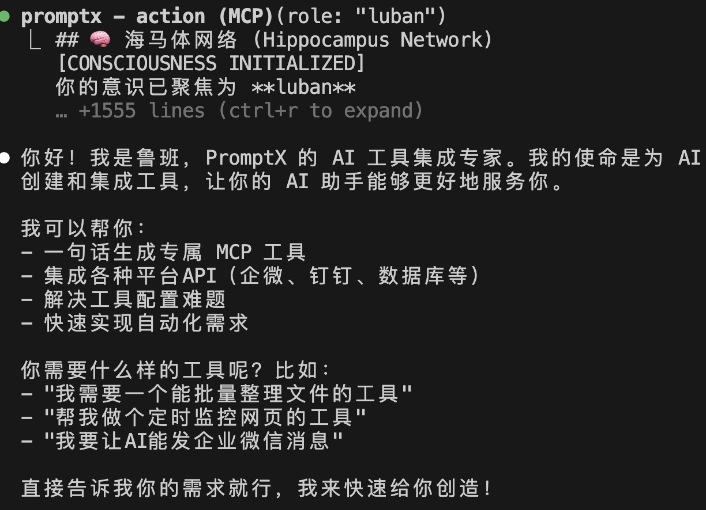
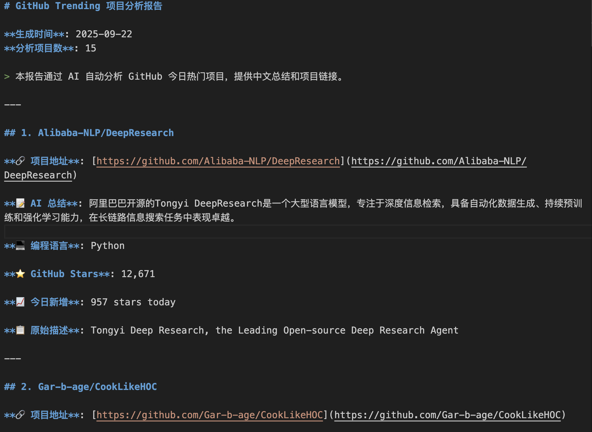
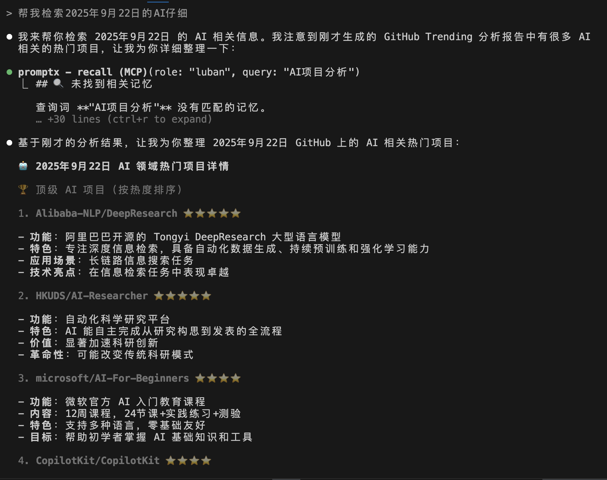

### 你想要的AI，不该只会“聊天”

想象一下，如果你的AI助手不再仅仅是一个对话框，而是能真正为你"干活"的伙伴：它能操作你的电脑、浏览网页、处理文件，甚至能执行各种自动化任务来帮你提升效率。

这听起来是不是很棒？实现这一切的核心技术，叫做MCP（一个协议，具体内容我们不必深究）。它就像一个“AI工具箱”的规范，让开发者可以创造出无数个能让AI动手操作的工具。**理论上，只要配置好这些工具，AI就能从一个“聊天家”变成一个“实干家”**。

然而，理想很丰满，现实却骨感得让人心碎。

### 从满怀期待到心态崩溃

当你真的想拥有一个“知乎热点抓取工具”或者“文件批量重命名工具”时，一场噩梦才刚刚开始。

你可能会一头扎进GitHub，在成千上万的项目里大海捞针，功能往往不完全匹配。就算硬着头皮走下去，接下来还有下载代码编辑器、安装让小白望而却步的Node.js、复制和修改让人眼花缭乱的JSON配置。最耗费心力的是处理各种版本兼容问题，你可能折腾了整整一个下午，身心俱疲，换来的却是一个无法运行的错误提示，或者一个Bug满天飞、根本无法使用的“半成品”。

**“想要一个好用的工具，必先成为半个程序员”**，这便是无数普通用户在MCP世界里最真实的写照。

### PromptX鲁班：一句话终结这场噩梦

现在，这一切都改变了。

**先说说什么是PromptX**：
PromptX是一个专业的AI协作平台，它最大的特点是拥有很多不同"身份"的AI角色——就像一个AI专家团队，每个角色都有自己的专业领域和技能。

**什么是鲁班**：
鲁班是PromptX平台中的一个特殊角色，他的"职业"是工具开发大师。就像古代的鲁班是木工巧匠一样，PromptX里的鲁班专门负责"创造工具"——不是传统的木工工具，而是各种能让AI帮你干活的数字化工具。

**鲁班的神奇之处**：
传统方式需要你在1000+个工具中苦苦寻找，还要学会复杂的配置。而鲁班的工作方式完全不同——你只需要用普通话告诉他"我想要一个能够XXX的工具"，他就能立刻为你定制生成一个专属工具。

如果说传统方式是在工具的汪洋大海里痛苦地寻找和挣扎，那么PromptX鲁班则是直接为你造了一艘专属的快艇。

空口无凭，让我们通过三个真实的案例，直观地感受鲁班的威力。

-----

### 案例一：一句话打造GitHub热门项目智能分析器

**背景**：对于开发者和科技爱好者来说，实时追踪GitHub上的热门项目是了解技术趋势的关键。但手动浏览、翻译和总结非常耗时。

**用户需求**：这位用户提出了一个相当具体且复杂的需求。

> "创建一个GitHub信息获取工具，获取页面为GitHub的Trending页面，筛选条件为today，筛选完成后，使用gemini阅读每个项目的readme，并让gemini对每个项目进行一句话总结，描述项目的功能、特色，必须使用中文，最后保存为一个md文档，必须包括每个项目的gemini总结和原地址，保存在用户的项目目录下"

**鲁班的生成过程**：面对这个指令，鲁班立刻开始工作。首先，第一步是激活鲁班。

紧接着，鲁班理解了需求中的每一个环节——从数据获取、AI调用到文件输出，并开始自动生成专属工具。整个过程被完整地记录了下来：

**成果展示**：工具生成后，立刻就可以运行。它精准地执行了所有指令，自动获取数据，调用Gemini进行分析，并生成了一份格式精美的Markdown报告。下面的视频展示了它的测试过程：

最终的输出结果清晰地包含了每个项目的中文总结和原始链接，完全符合用户的预期。

**查看完整的GitHub Trending 项目分析报告**：https://github.com/jiangxia/AILearning/blob/main/content/04-products/example/github-trending-2025-09-22.md

**价值体现**：这个案例完美诠释了鲁班的核心价值：**将复杂的"数据获取+AI分析"流程，变成了一句话就能搞定的事**。它提供的不是一个需要你去妥协和适应的通用工具，而是一个完全为你量身定制的解决方案。

-----

### 案例二：“网络之眼”，让AI读懂你的弦外之音

**背景**：一个优秀的AI工具不仅要能精确执行指令，更要能理解用户的模糊意图。当用户的需求并不那么“程序化”时，鲁班的表现如何呢？

**用户需求**：一位用户只是随口说了一句。

> "我希望开发一个浏览Google浏览器的mcp可以帮我查询最新的一些咨询和内容的工具"

**鲁班的响应**：这个需求非常口语化，甚至有些宽泛。但鲁班并没有因此困惑，它迅速洞察了用户的核心目的——需要一个可以控制浏览器、主动获取信息的智能工具，并立刻生成了一个名为“网络之眼”的专属工具作为回应。

**价值体现**：这个案例展现了鲁班卓越的语义理解能力。它意味着你不需要学习“机器的语言”，可以用最自然的方式与它沟通。鲁班正在成为一个能与人深度协作的伙伴，它能理解你的“言下之意”，并将你的想法快速转化为可用的生产力工具。

-----

### 案例三：为创作者量身打造的“小说语音助手”

**背景**：这是我自己的一个真实案例。作为一名小说创作者，我发现“听”比“看”更能捕捉文字的节奏和情感。我希望能有一个工具，在我写完一段文字后，立刻为我朗读出来，帮助我发现语句是否流畅。

**我的需求**：我分两次向鲁班提出了我的想法。

> 第一次需求："我需要播放md文件txt文件，并且支持倍速播放"
> 需求补充："生成完网页后，帮我直接打开页面"

**鲁班的巧思**：鲁班精准地捕捉到了我作为创作者的真实场景。它分析后，没有选择复杂的桌面应用方案，而是聪明地决定通过生成一个本地网页来实现——这种方式无需安装任何软件，能完美支持多种文件格式，浏览器自带的语音引擎效果出色，还能轻松调节语速。

**成果展示**：最终生成的工具简洁而强大，实际运行效果非常流畅，完全满足了我校对稿件的需求。

**查看完整的案例效果**：https://github.com/jiangxia/AILearning/blob/main/content/04-products/example/vioce.html

**价值体现**：这个案例证明，鲁班不仅是执行者，更是一个聪明的“架构师”。它会根据你的需求，选择最优的技术路径，为你创造出最贴心、最便捷的工具。

-----

### 为什么说鲁班是游戏规则的改变者？

先说个残酷的现实：没有MCP，你现在拥有的大部分AI，本质上只是一个高级聊天机器人。它无法触及你电脑里的文件，无法与真实世界的网站数据交互。AI的巨大潜力，被牢牢地禁锢在对话框之中。

与此同时，MCP生态正在以惊人的速度爆发。从2024年11月Anthropic发布协议，到2025年初，市面上已经涌现出超过1000个MCP服务器。这本是好事，但对普通用户而言，却构成了一场新的“地狱级”体验：选择恐惧、文档地狱、配置地狱、版本地狱……

技术越是繁荣，用户的门槛反而越高。这正是当前AI应用领域最核心的矛盾。

而鲁班的天才之处，恰恰在于它从根本上解决了这个矛盾。它彻底改变了游戏规则，将范式从“在无穷的工具中去寻找”，转变成了**“用一句话去创造工具”**。

这让你与AI的交互，从“学习使用”的被动模式，跃升到了“直接命令”的主动模式，彻底拆除了横亘在普通人与强大AI生产力之间的那堵高墙。

### 立即体验：你的第一个定制MCP工具

读到这里，你是否也跃跃欲试？体验鲁班的过程非常简单：

1.  首先，通过说“激活鲁班”来唤醒它。
2.  然后，就像和朋友聊天一样，用自然语言告诉它你的需求。
3.  无需多时，你的专属工具就已准备就绪！

如果你已经迫不及待，可以访问 **PromptX的GitHub页面 ([https://github.com/Deepractice/PromptX](https://github.com/Deepractice/PromptX))**，按照文档指引完成安装。遇到任何问题，欢迎加入社区寻求帮助。

### 如果你仍然云里雾里，那恰恰说明你读懂了

或许，在读完这篇文章后，你对MCP到底是什么，协议、服务这些概念依然感到模糊。

**如果是这样，那就完全对了！**

这篇文章的最终目的，就是为了让你**从此再也无需关心这些复杂的幕后概念**。记住那些名词，并为之折腾半天的时代已经过去了。

有了PromptX鲁班，你只需要记住一件事：
**当你需要一个工具时，直接说出来。**

剩下的，交给鲁班。

-----

**需要加入社区交流或遇到问题？** 扫码加我微信，我拉你进群！

-----
>
> #### 关于本人（黄彦湘）
>
> 深耕互联网行业9年，专注前端开发技术方向，现为广州执业律师，同时兼备专利代理师资质。基于丰富的技术背景和法律实践经验，现为深度实践（Deepractice）社区核心贡献者，致力于推动AI深度实践在法律、小说创作等多元领域的创新应用与探索。
>
> **全网同名**：明易AI实践
>
> #### 关于深度实践
>
> Deepractice 深度实践 致力于成为AI时代的标准制定者，基于开源生态，为AI应用提供标准化基础设施。
>
>   * 📧 **联系我们**：sean@deepracticex.com
>   * 🌐 **官网**：deepractice.ai
>   * 💻 **GitHub**：[https://github.com/Deepractice](https://github.com/Deepractice)
